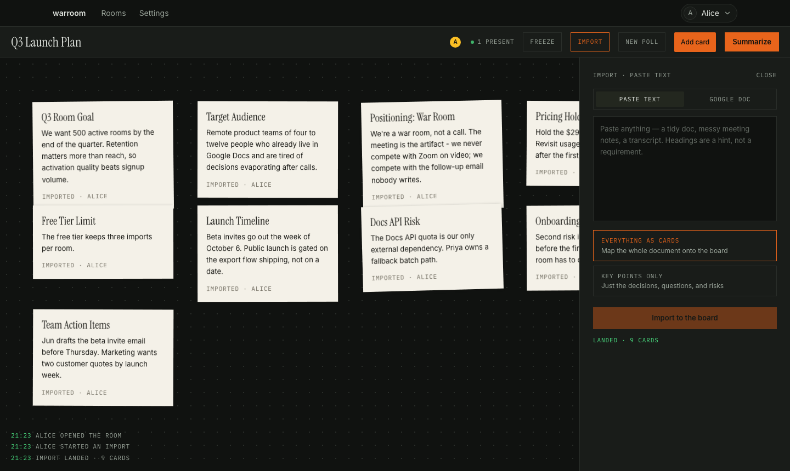

# Warroom

**A war room, not a call. The meeting is the artifact.**

Live: **https://warroomhq.app.space** — sign in, open a room, paste a messy doc into IMPORT, and open the room's link in a second window.

Import a document — tidy or messy — and it lands on a shared board as live cards. Triage together with presence cursors, settle contested points with live polls, let the facilitator freeze the room (server-enforced), and leave with an AI dispatch of what was decided.



## Layout

- `warroom/` — the DeepSpace app (Vite + React, Hono worker, Durable Objects)
- `docs/SUBMISSION.md` — what was built, capabilities used, the main tradeoff, agent vs. human verification
- `docs/REQUIREMENTS.md` / `docs/PLAN.md` — spec and staged plan (one commit per stage)
- `docs/BUGLOG.md` — every decision (D-###) and bug (B-###) as it happened; B-004 is the interesting one
- `design-brief.md` — the "newsroom wire terminal" visual identity

## Run it

```sh
cd warroom
npx deepspace dev start     # local dev
npx deepspace test run all  # 11 Playwright tests incl. the two-user freeze-enforcement spec
npm run test:unit           # 8 unit tests on the AI-output parsers
```

Built for the DeepSpace hiring exercise. See `docs/SUBMISSION.md` for the writeup.
