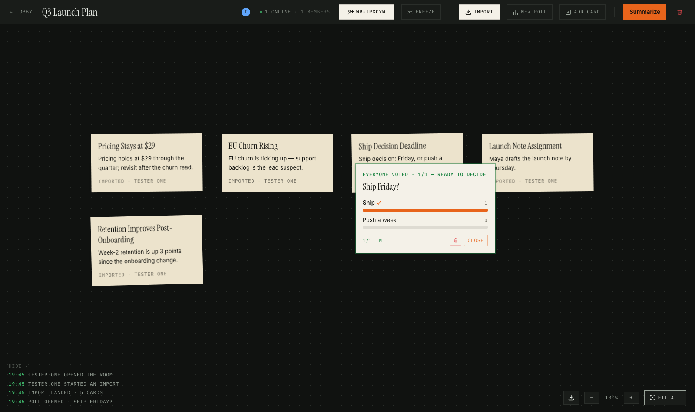
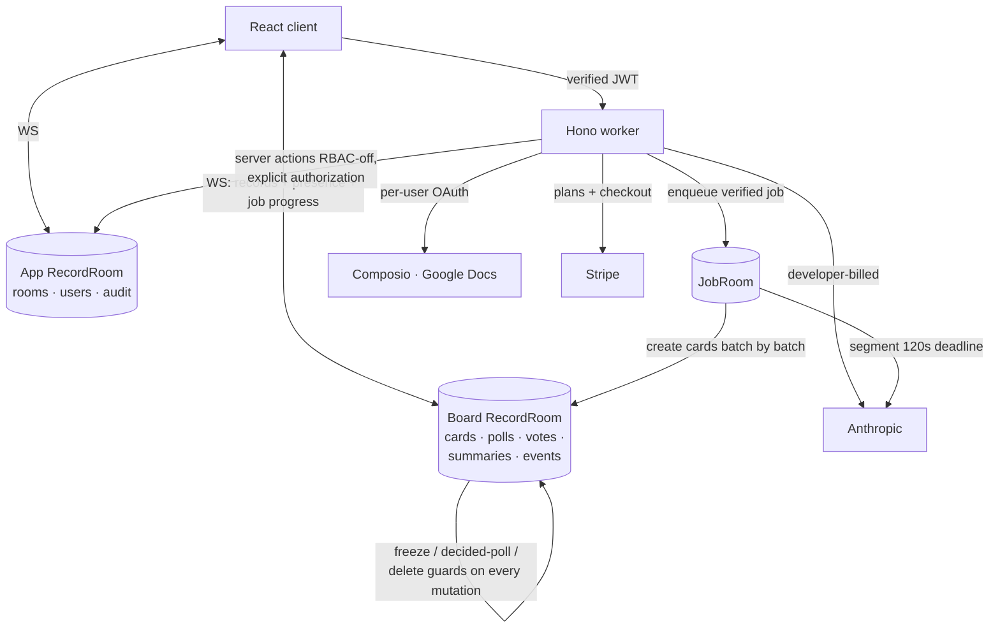
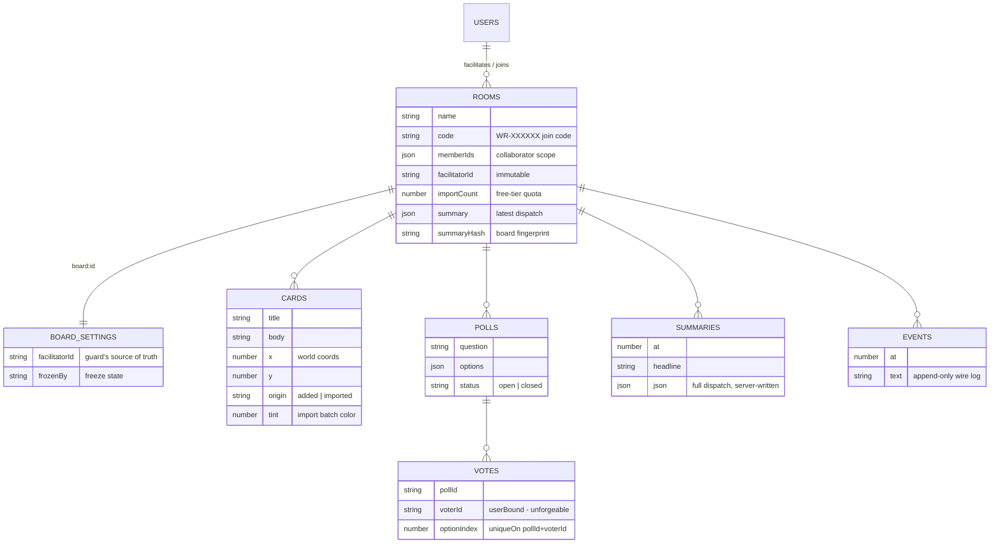
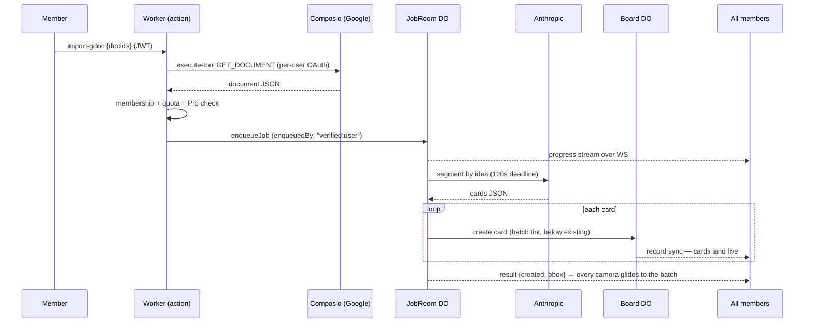
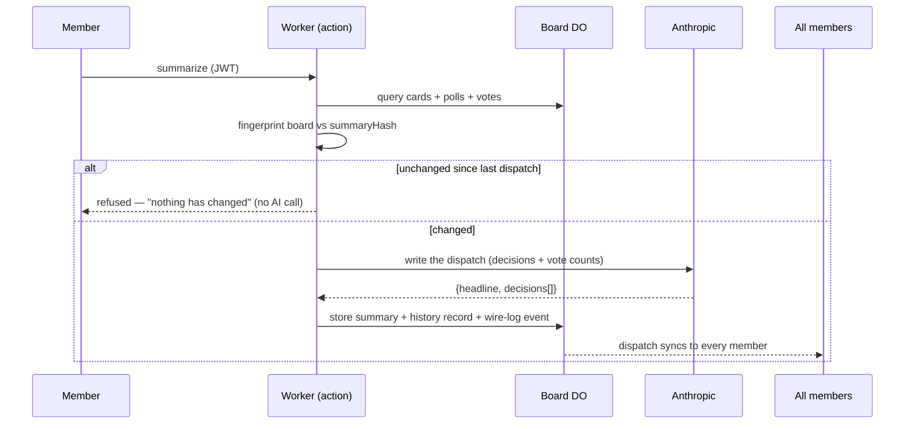

# 📰 Warroom

**A war room, not a call. The meeting is the artifact.**

A realtime, multi-user decision room built on the **DeepSpace SDK** (Vite + React, Hono worker, Cloudflare Durable Objects). Import documents from Google Drive or paste, argue over them as live cards, decide with one-vote polls, freeze the room server-side, and leave with an AI-written dispatch of what was decided.

**Live:** https://warroomhq.app.space — sign in and take the built-in 30-second walkthrough.



## 🚀 Key Features

- **AI document import** — paste anything or browse your own Google Docs (multi-select); the AI segments by *idea*, not headings, so messy notes work. Cards land live for everyone, each import batch on its own paper stock, and every camera glides to the new batch.
- **One-vote polls, enforced by the database** — `userBound` voter identity + a unique constraint make votes unforgeable; the card turns green when everyone has voted; decided polls are immutable (server-guarded).
- **Facilitator freeze, server-enforced** — not a disabled button: a raw WebSocket mutation from a frozen user is rejected at the Durable Object boundary (a Playwright spec proves it).
- **The AI dispatch** — "What was decided," with per-decision evidence and vote counts; full dispatch history; export as Markdown or PDF. Re-summarize is gated on a board *fingerprint*, not a timer.
- **An unlimited canvas, per-person camera** — pan, zoom, FIT ALL; marquee multi-select with group drag; presence cursors glued to content in world coordinates.
- **Join by link or WR- code** — shareable-link room model with a member roster (★ facilitator, online dots).
- **Free/Pro tiers with live Stripe checkout** — 3 rooms + 3 imports/room free, enforced server-side against forged requests; monthly or yearly Pro.
- **A guided interactive walkthrough** — spotlights the real UI, has you create your first room yourself, and demos each action with recorded clips.

## 🛠️ DeepSpace capabilities used (8)

| Capability | Where it matters |
|---|---|
| **Auth** | Everything behind sign-in; identity only from the verified JWT |
| **Realtime records** | Cards / polls / votes / settings / summaries / wire-log, per-board DO rooms |
| **RBAC + DO guards** | Schema permissions for static rules; message-boundary guards for time-varying ones (freeze, decided polls, poll deletion) |
| **Presence** | Live named cursors, roster, online-vs-member counts |
| **Background jobs** | Imports in the JobRoom: durable, retried, progress streamed to every member |
| **AI integration** | Anthropic via the platform: segmentation + the dispatch (developer-billed, deadline-guarded) |
| **Composio OAuth** | Google Docs as *yourself* — per-user consent, browse & multi-select, slugs verified via live discovery |
| **Payments** | Stripe plans synced from code; live checkout; server-side tier gates |

## 🏗️ Architecture



### Data model (ERD)

App scope holds the registry; each board is its own Durable Object room (`board:<id>`) with its own collections — room-scoped access comes from the platform, not hand-written filters.



### Import flow sequence



### Dispatch flow sequence



## ⚡ Run it

```sh
cd warroom
npx deepspace dev start     # local dev
npx deepspace test run all  # 11 Playwright tests incl. the two-user adversarial spec
npm run test:unit           # 21 unit tests (parsers, camera math, import-run aggregation)
```

## 🧪 Verification

The two-user Playwright spec doesn't test the happy path — it attacks the server: it pushes **raw WebSocket mutations through a frozen user's live socket** (past the disabled buttons), fires late votes and forged reopens at a decided poll, and asserts the Durable Object bounces every one — then proves the same writes land once legitimate. Every shipped round was additionally verified against production with scripted runs (real AI imports, two-user join-by-code, checkout probes stopping at checkout.stripe.com); screenshots in `docs/screenshots/`.

## 🧩 Engineering challenges (three favorites)

1. **The freeze that wasn't (B-004)** — the freeze looked perfect in the UI but was silently unenforced: the DO decided "am I a board?" from its first fetch URL, and a new board's first fetch is an internal action call. Only the raw-socket spec caught it. Fix: board-ness derives from the room's own data.
2. **The row that wouldn't leave (B-015)** — after leaving a room, your lobby row lingered: leaving revokes your read access, so the server *can't* push the membership update to you. Scoped-subscription staleness, invisible to happy-path tests.
3. **The immortal import (B-019)** — a hung AI call left a job `running` forever and the UI faithfully showed endless progress. Fixed at two independent layers: a server-side deadline that fails the job honestly, and client-side stuck-detection keyed to the *job's* age (not the panel's clock, which resets on reopen).

Full ledger, kept at the moment things happened: `docs/BUGLOG.md` (B-001…B-021, D-001…D-051).

## 📁 Layout

- `warroom/` — the DeepSpace app
- `docs/SUBMISSION.md` — the exercise writeup: capabilities, main tradeoff, agent vs. human verification
- `docs/DECISIONS.md` — curated architecture / security / UX decision record
- `docs/BUGLOG.md` — every bug and decision, chronologically
- `docs/REQUIREMENTS.md` / `docs/PLAN.md` — spec and staged plan (one commit per stage)
- `design-brief.md` — the "newsroom wire terminal" visual identity

Built for the DeepSpace hiring exercise. See `docs/SUBMISSION.md` for the writeup.
